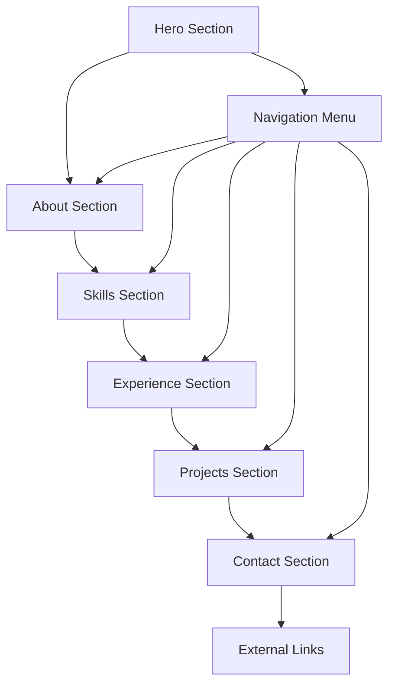

# Product Requirements Document - Portfolio Website Trương Quốc Huân

## 1. Product Overview
Portfolio website cá nhân cho Trương Quốc Huân - một developer với chuyên môn về web development. Website sẽ showcase kỹ năng, kinh nghiệm và các dự án đã thực hiện với thiết kế hiện đại, sử dụng hiệu ứng 3D và dynamic color system.

Mục tiêu chính: Tạo ấn tượng mạnh mẽ với nhà tuyển dụng và khách hàng tiềm năng thông qua trải nghiệm tương tác độc đáo và thể hiện năng lực kỹ thuật cao.

## 2. Core Features

### 2.1 User Roles
Không cần phân quyền user - website public cho tất cả visitors.

### 2.2 Feature Module
Portfolio website bao gồm các trang chính sau:
1. **Hero Section**: Landing area với hiệu ứng 3D, giới thiệu tên và chuyên môn
2. **About Section**: Thông tin cá nhân, background, passion
3. **Skills Section**: Technical skills với visual representation
4. **Experience Section**: Kinh nghiệm làm việc và học tập
5. **Projects Section**: Showcase các dự án nổi bật với demo/screenshots
6. **Contact Section**: Thông tin liên hệ và form contact

### 2.3 Page Details

| Page Name | Module Name | Feature description |
|-----------|-------------|---------------------|
| Hero Section | 3D Landing | Hiệu ứng Three.js với geometric shapes, animated text reveal, particle system background |
| Hero Section | Dynamic Intro | Animated typing effect cho tên và title, smooth scroll indicator |
| About Section | Personal Info | Ảnh profile với hover effects, mô tả ngắn gọn về background và passion |
| About Section | Interactive Timeline | Timeline tương tác về journey học tập và phát triển |
| Skills Section | Skill Visualization | 3D skill bars/charts, interactive hover effects, skill categories grouping |
| Skills Section | Technology Stack | Logo grid với animation, proficiency levels |
| Experience Section | Work History | Card-based layout với company info, role, achievements |
| Experience Section | Education | Academic background với interactive elements |
| Projects Section | Project Showcase | Grid layout với project cards, hover reveal details, live demo links |
| Projects Section | Project Details | Modal/overlay với screenshots, tech stack, GitHub links |
| Contact Section | Contact Form | Functional contact form với validation, success/error states |
| Contact Section | Social Links | Animated social media icons, email và GitHub links |
| Global | Navigation | Smooth scroll navigation, progress indicator, mobile responsive menu |
| Global | Theme System | Dynamic color system, smooth transitions, cream white base theme |

## 3. Core Process

User Journey:
1. User lands on Hero section với impressive 3D animation
2. Scroll down để explore About section và hiểu về background
3. View Skills section để thấy technical capabilities
4. Browse Experience section để hiểu career path
5. Explore Projects section để xem actual work
6. Contact section để kết nối

## 4. User Interface Design

### 4.1 Design Style
- **Primary Colors**: Cream White (#FAF7F0), Soft Beige (#F5F1E8)
- **Secondary Colors**: Dynamic accent colors (Blue #4A90E2, Green #7ED321, Purple #9013FE)
- **Button Style**: Rounded corners (8px), subtle shadows, hover animations
- **Font**: Inter/Poppins for headings, Open Sans for body text
- **Layout Style**: Modern minimalist, card-based components, generous whitespace
- **Icons**: Feather icons hoặc Lucide với subtle animations

### 4.2 Page Design Overview

| Page Name | Module Name | UI Elements |
|-----------|-------------|-------------|
| Hero Section | 3D Landing | Three.js canvas background, floating geometric shapes, gradient overlays |
| Hero Section | Typography | Large animated headings, gradient text effects, smooth reveal animations |
| About Section | Profile Card | Circular profile image với border animation, glassmorphism card design |
| About Section | Content Layout | Two-column layout, animated counters, skill highlights |
| Skills Section | 3D Visualization | Interactive 3D bars/spheres, hover glow effects, smooth transitions |
| Skills Section | Category Tabs | Animated tab switching, smooth content transitions |
| Experience Section | Timeline Design | Vertical timeline với animated markers, card hover effects |
| Projects Section | Grid Layout | Masonry/grid layout, image hover overlays, smooth modal transitions |
| Contact Section | Form Design | Floating labels, validation states, submit button animations |
| Global | Navigation | Fixed header với blur background, smooth scroll progress bar |

### 4.3 Responsiveness
Mobile-first approach với breakpoints:
- Mobile: 320px - 768px
- Tablet: 768px - 1024px  
- Desktop: 1024px+

Touch-optimized interactions cho mobile devices, simplified 3D effects trên mobile để đảm bảo performance.