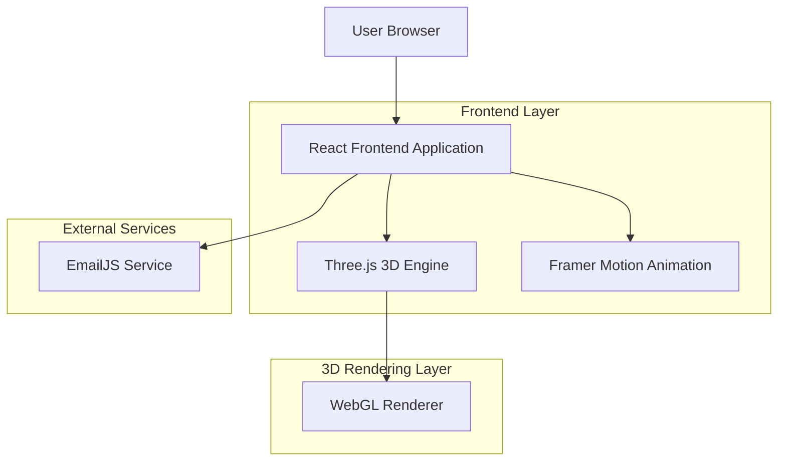
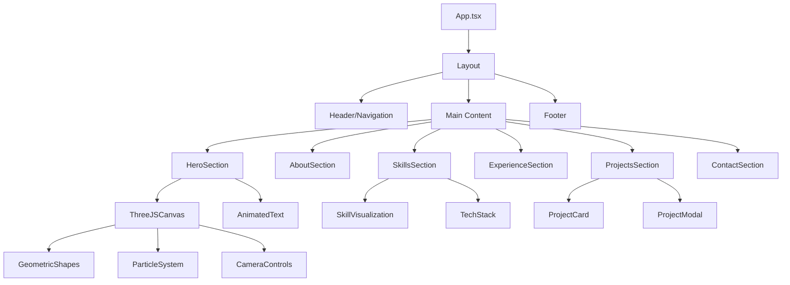

# Technical Architecture Document - Portfolio Website

## 1. Architecture Design



## 2. Technology Description

* **Frontend**: React\@18 + TypeScript + Vite

* **Styling**: Tailwind CSS\@3 + Styled Components

* **3D Graphics**: Three.js\@0.158 + React Three Fiber

* **Animations**: Framer Motion\@10 + GSAP\@3

* **Form Handling**: React Hook Form + EmailJS

* **Deployment**: Vercel/Netlify

## 3. Route Definitions

| Route        | Purpose                                                                                |
| ------------ | -------------------------------------------------------------------------------------- |
| /            | Single Page Application - tất cả sections trong một trang với smooth scroll navigation |
| /#hero       | Hero section với 3D landing animation                                                  |
| /#about      | About section với personal information                                                 |
| /#skills     | Skills showcase với interactive 3D elements                                            |
| /#experience | Work experience và education timeline                                                  |
| /#projects   | Project portfolio với detailed modals                                                  |
| /#contact    | Contact form và social links                                                           |

## 4. API Definitions

### 4.1 Core API

**Contact Form Submission**

```
POST https://api.emailjs.com/api/v1.0/email/send
```

Request:

| Param Name       | Param Type | isRequired | Description                      |
| ---------------- | ---------- | ---------- | -------------------------------- |
| service\_id      | string     | true       | EmailJS service identifier       |
| template\_id     | string     | true       | Email template identifier        |
| user\_id         | string     | true       | EmailJS user identifier          |
| template\_params | object     | true       | Form data (name, email, message) |

Response:

| Param Name | Param Type | Description      |
| ---------- | ---------- | ---------------- |
| status     | number     | HTTP status code |
| text       | string     | Response message |

Example Request:

```json
{
  "service_id": "service_xxx",
  "template_id": "template_xxx",
  "user_id": "user_xxx",
  "template_params": {
    "from_name": "John Doe",
    "from_email": "john@example.com",
    "message": "Hello, I'm interested in your work!"
  }
}
```

## 5. Component Architecture



## 6. Data Model

### 6.1 Data Structure Definitions

```typescript
// Personal Information
interface PersonalInfo {
  name: string;
  title: string;
  email: string;
  github: string;
  linkedin?: string;
  bio: string;
  avatar: string;
}

// Skills Data
interface Skill {
  id: string;
  name: string;
  category: 'frontend' | 'backend' | 'tools' | 'other';
  proficiency: number; // 0-100
  icon: string;
  color: string;
}

// Experience Data
interface Experience {
  id: string;
  type: 'work' | 'education';
  title: string;
  company: string;
  location: string;
  startDate: string;
  endDate: string | 'present';
  description: string[];
  technologies: string[];
}

// Project Data
interface Project {
  id: string;
  title: string;
  description: string;
  longDescription: string;
  technologies: string[];
  images: string[];
  liveUrl?: string;
  githubUrl?: string;
  featured: boolean;
  category: string;
}

// Contact Form
interface ContactForm {
  name: string;
  email: string;
  subject: string;
  message: string;
}

// Theme Configuration
interface ThemeConfig {
  colors: {
    primary: string;
    secondary: string;
    accent: string[];
    background: string;
    text: string;
  };
  animations: {
    duration: number;
    easing: string;
  };
}
```

### 6.2 Static Data Files

**Personal Data (data/personal.ts)**

```typescript
export const personalInfo: PersonalInfo = {
  name: "Trương Quốc Huân",
  title: "Full Stack Developer",
  email: "truonghuan0709@gmail.com",
  github: "https://github.com/QuocHuannn",
  bio: "Passionate developer with expertise in modern web technologies...",
  avatar: "/images/avatar.jpg"
};
```

**Skills Data (data/skills.ts)**

```typescript
export const skills: Skill[] = [
  {
    id: "react",
    name: "React",
    category: "frontend",
    proficiency: 90,
    icon: "react-icon",
    color: "#61DAFB"
  },
  // ... more skills
];
```

**Projects Data (data/projects.ts)**

```typescript
export const projects: Project[] = [
  {
    id: "project-1",
    title: "E-commerce Platform",
    description: "Modern e-commerce solution with React and Node.js",
    technologies: ["React", "Node.js", "MongoDB"],
    featured: true,
    // ... more project details
  },
  // ... more projects
];
```

## 7. Three.js Integration Strategy

### 7.1 3D Scene Setup

```typescript
// Core Three.js setup
interface SceneConfig {
  camera: {
    position: [number, number, number];
    fov: number;
  };
  renderer: {
    antialias: boolean;
    alpha: boolean;
  };
  lights: LightConfig[];
}

// Geometric shapes for hero section
interface GeometricShape {
  type: 'sphere' | 'cube' | 'torus' | 'cylinder';
  position: [number, number, number];
  rotation: [number, number, number];
  material: MaterialConfig;
  animation: AnimationConfig;
}
```

### 7.2 Performance Optimization

* **LOD (Level of Detail)**: Giảm complexity của 3D objects khi xa camera

* **Frustum Culling**: Chỉ render objects trong view

* **Texture Optimization**: Compressed textures, appropriate sizes

* **Mobile Fallbacks**: Simplified 3D effects cho mobile devices

### 7.3 Animation System

```typescript
// Animation timeline for hero section
interface AnimationTimeline {
  intro: {
    duration: number;
    shapes: ShapeAnimation[];
    camera: CameraAnimation;
    text: TextAnimation;
  };
  idle: {
    shapes: IdleAnimation[];
    particles: ParticleAnimation;
  };
}
```

