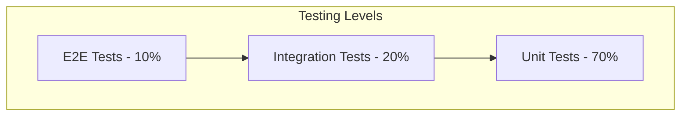

# Testing & Quality Assurance - Portfolio Website

## 1. Testing Strategy Overview

### 1.1 Testing Pyramid



### 1.2 Testing Scope

| Test Type | Coverage | Tools | Priority |
|-----------|----------|-------|----------|
| Unit Tests | Components, Utils, Hooks | Jest, React Testing Library | High |
| Integration Tests | API calls, Three.js integration | Jest, MSW | Medium |
| Visual Tests | UI consistency, Responsive | Storybook, Chromatic | Medium |
| E2E Tests | User workflows | Playwright | Low |
| Performance Tests | Loading, 3D rendering | Lighthouse, WebPageTest | High |
| Accessibility Tests | WCAG compliance | axe-core, WAVE | High |

## 2. Unit Testing

### 2.1 Component Testing

```typescript
// Example: Hero Section Test
import { render, screen } from '@testing-library/react';
import { Hero } from '../components/Hero';
import { personalInfo } from '../data/mockData';

describe('Hero Component', () => {
  it('renders personal information correctly', () => {
    render(<Hero data={personalInfo} />);
    
    expect(screen.getByText(personalInfo.name)).toBeInTheDocument();
    expect(screen.getByText(personalInfo.title)).toBeInTheDocument();
    expect(screen.getByText(personalInfo.description)).toBeInTheDocument();
  });
  
  it('displays contact buttons', () => {
    render(<Hero data={personalInfo} />);
    
    expect(screen.getByRole('button', { name: /contact me/i })).toBeInTheDocument();
    expect(screen.getByRole('link', { name: /download cv/i })).toBeInTheDocument();
  });
  
  it('handles Three.js canvas fallback', () => {
    // Mock Three.js failure
    jest.spyOn(console, 'error').mockImplementation(() => {});
    
    render(<Hero data={personalInfo} />);
    
    // Should show fallback content when 3D fails
    expect(screen.getByTestId('hero-fallback')).toBeInTheDocument();
  });
});
```

### 2.2 Hook Testing

```typescript
// Example: useTheme Hook Test
import { renderHook, act } from '@testing-library/react';
import { useTheme } from '../hooks/useTheme';

describe('useTheme Hook', () => {
  it('initializes with default theme', () => {
    const { result } = renderHook(() => useTheme());
    
    expect(result.current.theme).toBe('light');
    expect(result.current.colors.primary).toBe('#FAF7F0');
  });
  
  it('toggles theme correctly', () => {
    const { result } = renderHook(() => useTheme());
    
    act(() => {
      result.current.toggleTheme();
    });
    
    expect(result.current.theme).toBe('dark');
  });
  
  it('persists theme preference', () => {
    const { result } = renderHook(() => useTheme());
    
    act(() => {
      result.current.setTheme('dark');
    });
    
    expect(localStorage.getItem('theme')).toBe('dark');
  });
});
```

### 2.3 Utility Function Testing

```typescript
// Example: Animation Utils Test
import { createStaggerAnimation, calculateScrollProgress } from '../utils/animations';

describe('Animation Utils', () => {
  describe('createStaggerAnimation', () => {
    it('creates stagger animation with correct delay', () => {
      const animation = createStaggerAnimation(3, 0.1);
      
      expect(animation.transition.staggerChildren).toBe(0.1);
      expect(animation.transition.delayChildren).toBe(0.3);
    });
  });
  
  describe('calculateScrollProgress', () => {
    it('calculates scroll progress correctly', () => {
      const progress = calculateScrollProgress(500, 1000, 200);
      expect(progress).toBe(0.5);
    });
    
    it('clamps progress between 0 and 1', () => {
      expect(calculateScrollProgress(-100, 1000, 200)).toBe(0);
      expect(calculateScrollProgress(1500, 1000, 200)).toBe(1);
    });
  });
});
```

## 3. Integration Testing

### 3.1 Three.js Integration

```typescript
// Example: Three.js Scene Test
import { render } from '@testing-library/react';
import { ThreeScene } from '../components/ThreeScene';

// Mock Three.js
jest.mock('three', () => ({
  Scene: jest.fn(() => ({
    add: jest.fn(),
    remove: jest.fn()
  })),
  WebGLRenderer: jest.fn(() => ({
    setSize: jest.fn(),
    render: jest.fn(),
    dispose: jest.fn()
  })),
  PerspectiveCamera: jest.fn()
}));

describe('Three.js Integration', () => {
  it('initializes scene correctly', () => {
    const { container } = render(<ThreeScene />);
    const canvas = container.querySelector('canvas');
    
    expect(canvas).toBeInTheDocument();
  });
  
  it('handles resize events', () => {
    const { container } = render(<ThreeScene />);
    
    // Trigger resize
    global.dispatchEvent(new Event('resize'));
    
    // Should update canvas dimensions
    const canvas = container.querySelector('canvas');
    expect(canvas).toHaveAttribute('width');
    expect(canvas).toHaveAttribute('height');
  });
  
  it('cleans up resources on unmount', () => {
    const { unmount } = render(<ThreeScene />);
    
    unmount();
    
    // Should dispose of Three.js resources
    // This would be tested with spy functions
  });
});
```

### 3.2 API Integration

```typescript
// Example: Contact Form Integration Test
import { render, screen, fireEvent, waitFor } from '@testing-library/react';
import { ContactForm } from '../components/ContactForm';
import { server } from '../mocks/server';
import { rest } from 'msw';

describe('Contact Form Integration', () => {
  it('submits form successfully', async () => {
    render(<ContactForm />);
    
    fireEvent.change(screen.getByLabelText(/name/i), {
      target: { value: 'John Doe' }
    });
    fireEvent.change(screen.getByLabelText(/email/i), {
      target: { value: 'john@example.com' }
    });
    fireEvent.change(screen.getByLabelText(/message/i), {
      target: { value: 'Hello there!' }
    });
    
    fireEvent.click(screen.getByRole('button', { name: /send message/i }));
    
    await waitFor(() => {
      expect(screen.getByText(/message sent successfully/i)).toBeInTheDocument();
    });
  });
  
  it('handles API errors gracefully', async () => {
    // Mock API error
    server.use(
      rest.post('/api/contact', (req, res, ctx) => {
        return res(ctx.status(500), ctx.json({ error: 'Server error' }));
      })
    );
    
    render(<ContactForm />);
    
    // Fill and submit form
    fireEvent.click(screen.getByRole('button', { name: /send message/i }));
    
    await waitFor(() => {
      expect(screen.getByText(/something went wrong/i)).toBeInTheDocument();
    });
  });
});
```

## 4. Visual Testing

### 4.1 Storybook Stories

```typescript
// Example: Button Component Stories
import type { Meta, StoryObj } from '@storybook/react';
import { Button } from '../components/Button';

const meta: Meta<typeof Button> = {
  title: 'Components/Button',
  component: Button,
  parameters: {
    layout: 'centered',
  },
  tags: ['autodocs'],
  argTypes: {
    variant: {
      control: { type: 'select' },
      options: ['primary', 'secondary', 'ghost'],
    },
    size: {
      control: { type: 'select' },
      options: ['sm', 'md', 'lg'],
    },
  },
};

export default meta;
type Story = StoryObj<typeof meta>;

export const Primary: Story = {
  args: {
    variant: 'primary',
    children: 'Primary Button',
  },
};

export const Secondary: Story = {
  args: {
    variant: 'secondary',
    children: 'Secondary Button',
  },
};

export const WithIcon: Story = {
  args: {
    variant: 'primary',
    children: 'Download CV',
    icon: 'download',
  },
};

// Responsive testing
export const Mobile: Story = {
  args: {
    variant: 'primary',
    children: 'Mobile Button',
  },
  parameters: {
    viewport: {
      defaultViewport: 'mobile1',
    },
  },
};
```

### 4.2 Visual Regression Testing

```typescript
// Example: Chromatic Configuration
// .storybook/main.ts
export default {
  stories: ['../src/**/*.stories.@(js|jsx|ts|tsx)'],
  addons: [
    '@storybook/addon-essentials',
    '@storybook/addon-a11y',
    '@chromatic-com/storybook'
  ],
};

// chromatic.yml (GitHub Actions)
name: 'Chromatic'
on: push

jobs:
  chromatic-deployment:
    runs-on: ubuntu-latest
    steps:
      - uses: actions/checkout@v3
        with:
          fetch-depth: 0
      - uses: actions/setup-node@v3
        with:
          node-version: 18
      - run: npm ci
      - run: npm run build-storybook
      - uses: chromaui/action@v1
        with:
          projectToken: ${{ secrets.CHROMATIC_PROJECT_TOKEN }}
```

## 5. E2E Testing

### 5.1 Playwright Configuration

```typescript
// playwright.config.ts
import { defineConfig, devices } from '@playwright/test';

export default defineConfig({
  testDir: './e2e',
  fullyParallel: true,
  forbidOnly: !!process.env.CI,
  retries: process.env.CI ? 2 : 0,
  workers: process.env.CI ? 1 : undefined,
  reporter: 'html',
  use: {
    baseURL: 'http://localhost:3000',
    trace: 'on-first-retry',
    screenshot: 'only-on-failure',
  },
  projects: [
    {
      name: 'chromium',
      use: { ...devices['Desktop Chrome'] },
    },
    {
      name: 'firefox',
      use: { ...devices['Desktop Firefox'] },
    },
    {
      name: 'webkit',
      use: { ...devices['Desktop Safari'] },
    },
    {
      name: 'Mobile Chrome',
      use: { ...devices['Pixel 5'] },
    },
  ],
  webServer: {
    command: 'npm run dev',
    url: 'http://localhost:3000',
    reuseExistingServer: !process.env.CI,
  },
});
```

### 5.2 E2E Test Examples

```typescript
// e2e/portfolio-navigation.spec.ts
import { test, expect } from '@playwright/test';

test.describe('Portfolio Navigation', () => {
  test('navigates through all sections', async ({ page }) => {
    await page.goto('/');
    
    // Test hero section
    await expect(page.getByRole('heading', { name: /truong quoc huan/i })).toBeVisible();
    
    // Test navigation
    await page.getByRole('link', { name: /about/i }).click();
    await expect(page.locator('#about')).toBeInViewport();
    
    await page.getByRole('link', { name: /skills/i }).click();
    await expect(page.locator('#skills')).toBeInViewport();
    
    await page.getByRole('link', { name: /experience/i }).click();
    await expect(page.locator('#experience')).toBeInViewport();
    
    await page.getByRole('link', { name: /projects/i }).click();
    await expect(page.locator('#projects')).toBeInViewport();
    
    await page.getByRole('link', { name: /contact/i }).click();
    await expect(page.locator('#contact')).toBeInViewport();
  });
  
  test('contact form submission', async ({ page }) => {
    await page.goto('/');
    await page.getByRole('link', { name: /contact/i }).click();
    
    // Fill contact form
    await page.getByLabel(/name/i).fill('Test User');
    await page.getByLabel(/email/i).fill('test@example.com');
    await page.getByLabel(/message/i).fill('This is a test message');
    
    // Submit form
    await page.getByRole('button', { name: /send message/i }).click();
    
    // Verify success message
    await expect(page.getByText(/message sent successfully/i)).toBeVisible();
  });
  
  test('responsive design', async ({ page }) => {
    // Test mobile viewport
    await page.setViewportSize({ width: 375, height: 667 });
    await page.goto('/');
    
    // Mobile menu should be visible
    await expect(page.getByRole('button', { name: /menu/i })).toBeVisible();
    
    // Desktop navigation should be hidden
    await expect(page.locator('nav ul')).toBeHidden();
    
    // Test tablet viewport
    await page.setViewportSize({ width: 768, height: 1024 });
    await page.reload();
    
    // Navigation should adapt
    await expect(page.locator('nav ul')).toBeVisible();
  });
});
```

## 6. Performance Testing

### 6.1 Lighthouse CI Configuration

```json
// lighthouserc.json
{
  "ci": {
    "collect": {
      "url": ["http://localhost:3000"],
      "numberOfRuns": 3
    },
    "assert": {
      "assertions": {
        "categories:performance": ["error", {"minScore": 0.9}],
        "categories:accessibility": ["error", {"minScore": 0.9}],
        "categories:best-practices": ["error", {"minScore": 0.9}],
        "categories:seo": ["error", {"minScore": 0.9}]
      }
    },
    "upload": {
      "target": "temporary-public-storage"
    }
  }
}
```

### 6.2 Performance Monitoring

```typescript
// utils/performance.ts
export const measurePerformance = () => {
  // Core Web Vitals
  const observer = new PerformanceObserver((list) => {
    list.getEntries().forEach((entry) => {
      switch (entry.entryType) {
        case 'largest-contentful-paint':
          console.log('LCP:', entry.startTime);
          break;
        case 'first-input':
          console.log('FID:', entry.processingStart - entry.startTime);
          break;
        case 'layout-shift':
          console.log('CLS:', entry.value);
          break;
      }
    });
  });
  
  observer.observe({ entryTypes: ['largest-contentful-paint', 'first-input', 'layout-shift'] });
};

// Three.js Performance Monitoring
export const monitorThreeJSPerformance = (renderer: THREE.WebGLRenderer) => {
  const stats = {
    fps: 0,
    frameTime: 0,
    memoryUsage: 0
  };
  
  const info = renderer.info;
  
  return {
    getFPS: () => stats.fps,
    getMemoryUsage: () => info.memory,
    getRenderCalls: () => info.render.calls,
    getTriangles: () => info.render.triangles
  };
};
```

## 7. Accessibility Testing

### 7.1 Automated A11y Testing

```typescript
// Example: Accessibility Test
import { render } from '@testing-library/react';
import { axe, toHaveNoViolations } from 'jest-axe';
import { App } from '../App';

expect.extend(toHaveNoViolations);

describe('Accessibility Tests', () => {
  it('should not have any accessibility violations', async () => {
    const { container } = render(<App />);
    const results = await axe(container);
    expect(results).toHaveNoViolations();
  });
  
  it('supports keyboard navigation', async () => {
    render(<App />);
    
    // Test tab navigation
    const firstFocusable = document.querySelector('[tabindex="0"]');
    firstFocusable?.focus();
    
    // Simulate tab key
    fireEvent.keyDown(document.activeElement!, { key: 'Tab' });
    
    // Verify focus moved
    expect(document.activeElement).not.toBe(firstFocusable);
  });
  
  it('provides proper ARIA labels', () => {
    render(<App />);
    
    // Check for ARIA landmarks
    expect(screen.getByRole('banner')).toBeInTheDocument(); // header
    expect(screen.getByRole('main')).toBeInTheDocument(); // main content
    expect(screen.getByRole('contentinfo')).toBeInTheDocument(); // footer
    
    // Check for ARIA labels on interactive elements
    expect(screen.getByLabelText(/toggle navigation/i)).toBeInTheDocument();
  });
});
```

### 7.2 Manual A11y Checklist

```markdown
## Manual Accessibility Testing Checklist

### Keyboard Navigation
- [ ] All interactive elements are keyboard accessible
- [ ] Tab order is logical and intuitive
- [ ] Focus indicators are clearly visible
- [ ] Skip links are provided for main content
- [ ] Escape key closes modals/dropdowns

### Screen Reader Testing
- [ ] All images have appropriate alt text
- [ ] Headings create a logical document outline
- [ ] Form labels are properly associated
- [ ] ARIA landmarks are used correctly
- [ ] Dynamic content changes are announced

### Visual Testing
- [ ] Color contrast meets WCAG AA standards (4.5:1)
- [ ] Text is readable at 200% zoom
- [ ] Content reflows properly on mobile
- [ ] No information is conveyed by color alone
- [ ] Focus indicators are visible

### Motor Impairments
- [ ] Click targets are at least 44px × 44px
- [ ] Hover states don't hide essential content
- [ ] Drag and drop has keyboard alternatives
- [ ] Time limits can be extended or disabled
```

## 8. Test Data Management

### 8.1 Mock Data Structure

```typescript
// data/mockData.ts
export const mockPersonalInfo = {
  name: 'Truong Quoc Huan',
  title: 'Full Stack Developer',
  email: 'truongquochuan@example.com',
  github: 'https://github.com/truongquochuan',
  description: 'Passionate developer with expertise in modern web technologies'
};

export const mockSkills = [
  { name: 'React', level: 90, category: 'Frontend' },
  { name: 'Node.js', level: 85, category: 'Backend' },
  { name: 'TypeScript', level: 88, category: 'Language' },
  { name: 'Three.js', level: 75, category: 'Graphics' }
];

export const mockProjects = [
  {
    id: 1,
    title: 'E-commerce Platform',
    description: 'Full-stack e-commerce solution',
    technologies: ['React', 'Node.js', 'MongoDB'],
    github: 'https://github.com/example/ecommerce',
    demo: 'https://demo.example.com',
    image: '/images/project1.jpg'
  }
];
```

### 8.2 Test Environment Setup

```typescript
// setupTests.ts
import '@testing-library/jest-dom';
import { server } from './mocks/server';

// Mock IntersectionObserver
global.IntersectionObserver = jest.fn().mockImplementation(() => ({
  observe: jest.fn(),
  unobserve: jest.fn(),
  disconnect: jest.fn()
}));

// Mock ResizeObserver
global.ResizeObserver = jest.fn().mockImplementation(() => ({
  observe: jest.fn(),
  unobserve: jest.fn(),
  disconnect: jest.fn()
}));

// Mock Three.js WebGL context
Object.defineProperty(HTMLCanvasElement.prototype, 'getContext', {
  value: jest.fn(() => ({
    getExtension: jest.fn(),
    getParameter: jest.fn(),
    createShader: jest.fn(),
    shaderSource: jest.fn(),
    compileShader: jest.fn(),
    createProgram: jest.fn()
  }))
});

// Setup MSW
beforeAll(() => server.listen());
afterEach(() => server.resetHandlers());
afterAll(() => server.close());
```

## 9. CI/CD Testing Pipeline

### 9.1 GitHub Actions Workflow

```yaml
# .github/workflows/test.yml
name: Test Suite

on:
  push:
    branches: [main, develop]
  pull_request:
    branches: [main]

jobs:
  test:
    runs-on: ubuntu-latest
    
    strategy:
      matrix:
        node-version: [18.x, 20.x]
    
    steps:
      - uses: actions/checkout@v3
      
      - name: Use Node.js ${{ matrix.node-version }}
        uses: actions/setup-node@v3
        with:
          node-version: ${{ matrix.node-version }}
          cache: 'npm'
      
      - name: Install dependencies
        run: npm ci
      
      - name: Run linting
        run: npm run lint
      
      - name: Run type checking
        run: npm run type-check
      
      - name: Run unit tests
        run: npm run test:unit -- --coverage
      
      - name: Run integration tests
        run: npm run test:integration
      
      - name: Build application
        run: npm run build
      
      - name: Run E2E tests
        run: npm run test:e2e
      
      - name: Run Lighthouse CI
        run: npm run lighthouse:ci
      
      - name: Upload coverage to Codecov
        uses: codecov/codecov-action@v3
        with:
          file: ./coverage/lcov.info
      
      - name: Visual regression testing
        run: npm run chromatic
        env:
          CHROMATIC_PROJECT_TOKEN: ${{ secrets.CHROMATIC_PROJECT_TOKEN }}
```

## 10. Quality Gates

### 10.1 Code Quality Metrics

```json
// package.json scripts
{
  "scripts": {
    "test:unit": "jest --testPathPattern=src/",
    "test:integration": "jest --testPathPattern=integration/",
    "test:e2e": "playwright test",
    "test:a11y": "jest --testNamePattern=accessibility",
    "test:coverage": "jest --coverage --coverageThreshold='{\"global\":{\"branches\":80,\"functions\":80,\"lines\":80,\"statements\":80}}'",
    "lighthouse:ci": "lhci autorun",
    "chromatic": "chromatic --exit-zero-on-changes"
  }
}
```

### 10.2 Quality Thresholds

| Metric | Threshold | Tool |
|--------|-----------|------|
| Code Coverage | ≥ 80% | Jest |
| Performance Score | ≥ 90 | Lighthouse |
| Accessibility Score | ≥ 90 | Lighthouse |
| Bundle Size | < 500KB | Bundlephobia |
| First Contentful Paint | < 1.5s | Lighthouse |
| Largest Contentful Paint | < 2.5s | Lighthouse |
| Cumulative Layout Shift | < 0.1 | Lighthouse |
| Time to Interactive | < 3.5s | Lighthouse |

## 11. Bug Tracking & Reporting

### 11.1 Bug Report Template

```markdown
## Bug Report

**Description:**
A clear and concise description of the bug.

**Steps to Reproduce:**
1. Go to '...'
2. Click on '....'
3. Scroll down to '....'
4. See error

**Expected Behavior:**
A clear description of what you expected to happen.

**Actual Behavior:**
A clear description of what actually happened.

**Screenshots:**
If applicable, add screenshots to help explain your problem.

**Environment:**
- OS: [e.g. iOS]
- Browser: [e.g. chrome, safari]
- Version: [e.g. 22]
- Device: [e.g. iPhone6]

**Additional Context:**
Add any other context about the problem here.

**Priority:** [Low/Medium/High/Critical]
**Labels:** [bug, ui, performance, accessibility]
```

### 11.2 Test Results Dashboard

```typescript
// Example: Test Results Summary
interface TestResults {
  unit: {
    passed: number;
    failed: number;
    coverage: number;
  };
  integration: {
    passed: number;
    failed: number;
  };
  e2e: {
    passed: number;
    failed: number;
  };
  performance: {
    score: number;
    metrics: {
      fcp: number;
      lcp: number;
      cls: number;
      fid: number;
    };
  };
  accessibility: {
    score: number;
    violations: number;
  };
}
```

Tài liệu này cung cấp framework testing toàn diện để đảm bảo chất lượng cao cho portfolio website, bao gồm tất cả các khía cạnh từ unit testing đến performance và accessibility testing.